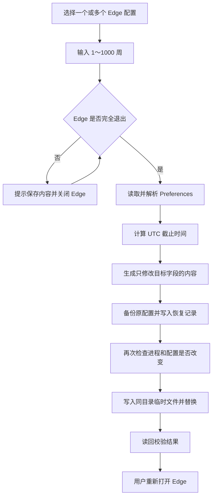

# Edge 扩展提醒延期：逻辑与实现原理

版本：1.0.0

编写日期：2026-09-12

## 1. 软件解决什么问题

用户通过开发者模式加载解压扩展后，Edge 可能弹出“关闭开发人员模式下的扩展”提醒。常见的“以后再说”选项只允许延后两周。

本软件允许把下次提醒截止时间设为当前时间之后的 **1～1000 个整数周**。它修改浏览器的用户偏好设置，保留开发者模式及扩展设置。

软件并不重新编译 Edge，也不修改 Edge 弹窗菜单的文字或选项。

## 2. 修改的配置项

Edge 的每个个人资料目录有自己的 `Preferences` 文件，其内容为 JSON。提醒截止时间位于：

```text
extensions.ui.dev_mode_warning_snooze_end_time
```

示意结构：

```json
{
  "extensions": {
    "ui": {
      "dev_mode_warning_snooze_end_time": "14037850596017245"
    }
  }
}
```

示例中的值对应北京时间 `2045-11-04 10:56:36.017245`，只是说明格式，不是软件每次写入的固定数值。实际数值根据用户选择的周数和点击应用时的时间计算。

虽然 JSON 中使用字符串保存长整数，但程序会将其解析为时间参与比较。修改它是在修改计算所用的配置值。

## 3. 周数如何换算为时间

该时间采用自 **1601-01-01 00:00:00 UTC** 起累计的微秒数。

设用户选择的周数为 `W`：

```text
1 ≤ W ≤ 1000，且 W 为整数

截止时间 UTC = 点击应用时的 UTC 时间 + W × 7 天

保存值 = (截止时间 UTC - 1601-01-01 00:00:00 UTC) 的微秒数
```

实现中使用 .NET 的 64 位时间 tick 计算：

```text
微秒数 = 时间差的 Ticks / 10
```

每个 tick 为 100 纳秒，因此 10 个 tick 等于 1 微秒。整个运算不依赖浮点时间戳，避免大整数精度丢失。

计算使用 UTC，界面将日期转换为当前电脑的本地时间。1000 周为 7000 天，约 19.2 年。日期预览随着周数选择变化；最终截止时间从点击应用时重新计算。

## 4. 为什么不只是“两周后提醒”

对本机 Edge `153.0.4234.32` 的 `msedge.dll` 进行了只读反汇编核验。相关代码读取上面的完整配置项，比较当前时间与保存的截止时间。

对应判断可简化为以下伪代码。这是分析说明，并非微软公开源码：

```text
截止时间 = 从 Preferences 读取并解析提醒时间

如果 当前时间 < 截止时间：
    返回 false，跳过此次提醒

继续执行其他提醒条件判断
```

在检查到的读取和判断路径中，没有把截止时间强制限制到两周以内的逻辑。

另两段相关操作处理代码中存在如下写入行为：

```text
保存的截止时间 = 当前时间 + 14 天
```

其中常量 `0x119A1C74000` 等于 `1,209,600,000,000` 微秒，恰好是 14 天。因此，在核验的这个版本里，两周是延期操作写入的期限，而实际提醒判断直接采用已保存的截止时间。

### 代码核验证据

以下地址为该版本文件的 RVA，即相对于模块起始位置的偏移；不同版本地址通常会变化。

| 证据 | RVA / 数值 |
| --- | --- |
| 完整配置键字符串 | `0x129DBE80` |
| 读取时间和决定是否继续提醒的函数 | `0x0C7485F0`–`0x0C7486CC` |
| 比较当前时间与保存时间 | `0x0C748654` |
| 当前时间尚未达到截止时间时返回 false | `0x0C748659` |
| 加上两周期限的相关处理函数 | `0x0C748840`–`0x0C7489BD`、`0x0C7489C0`–`0x0C748AC8` |
| 时间读取及转换路径 | `0x0111E586`、`0x0111E6B0`、`0x0111E720` |
| 被核验的 `msedge.dll` SHA-256 | `81C72A02544FDF4298B6AFC846F0670D18F408F06F844C818AD1D9820C2A201F` |

软件执行时不反汇编、不扫描这些代码地址，也不修改 DLL。这些证据用于说明方法依据，软件本身只处理配置文件。

## 5. 自动识别路径的方式

软件不需要依赖 `msedge.exe` 的固定安装路径。它的修改目标是用户数据目录，所以 Edge 程序安装在其他盘符通常不会影响操作。

### 常见通道

运行时通过 Windows 获取当前用户的 `LocalApplicationData`，然后检查：

```text
<LocalApplicationData>\Microsoft\Edge\User Data
<LocalApplicationData>\Microsoft\Edge Beta\User Data
<LocalApplicationData>\Microsoft\Edge Dev\User Data
<LocalApplicationData>\Microsoft\Edge SxS\User Data
```

程序不会硬编码开发电脑的用户名、用户主目录或系统盘符。

### 自定义目录

软件还会：

1. 读取当前用户和本机的 Edge `UserDataDir` 策略，兼顾 32 位和 64 位注册表视图。
2. 展开 `${local_app_data}`、`${profile}`、`${user_name}` 等受支持路径变量。
3. 查询当前 Windows 会话中 `msedge.exe` 的命令行，提取 `--user-data-dir`。参数解析使用 Windows 的 `CommandLineToArgvW`，支持带空格和引号的路径。
4. 检查数据目录中各个包含 `Preferences` 的直接子目录，不仅限于 `Default` 或英文名称。
5. 允许用户手动选择 `User Data`、个人资料目录，或名为 `Preferences` 的文件。

自动查找覆盖常见布局，不会遍历整块硬盘。未运行且没有注册策略的便携版、自定义启动器目录可能需要手动选择。手动添加的路径只在当前软件会话内保留。

用户可以在 `edge://version` 页面查看“个人资料路径”，作为手动选择依据。

## 6. 修改流程



### 字段级修改

软件内置了一个 JSON 位置解析器，记录字段和数值在原文中的位置。对已有配置项，只替换它的值；其他字段不重新序列化。

这保留了其他内容的原始文本，包括大整数、Unicode 转义、字符串和文件编码信息。即使其他层级出现同名字段，也不会误改。

如果 `extensions`、`ui` 或目标字段不存在，可以在正确层级创建。字段类型异常、JSON 不完整、重复键或非法 UTF-8 会阻止操作。配置大小上限为 64 MiB，嵌套深度也有限制。

### 写入与并发检查

应用前和正式替换前都会检查当前 Windows 会话的 Edge 进程，并核对原文件内容是否仍与读取时一致。软件使用同目录临时文件、刷新写入和 `File.Replace`，避免采用先清空原文件再写入的方式。

文件只读、被独占打开或内容发生变化时，软件报告错误。多配置操作分别记录结果：如果个别配置失败，已经成功的配置会保留其修改和备份，界面会分别报告成功和失败数量，不会声称全部成功。

进程检测与内容比对可以降低并发写入风险，但不应在应用过程中主动重新启动 Edge。

## 7. 备份与撤销

默认备份目录为：

```text
<LocalApplicationData>\EdgeReminder\Backups
```

每个个人资料使用其完整路径的哈希生成独立子目录。每次修改保存：

- 完整的原始 `Preferences` 字节备份。
- 记录原字段是否存在、原始字段值、本次写入值、时间及恢复状态的 JSON 记录。

“撤销上次修改”读取最近一条可撤销记录，仅恢复提醒字段。若本次修改新建了空对象，撤销会在仍为空时清理这些对象；若其中已添加其他内容，则保留。

如果提醒时间被其他程序或用户再次修改，软件拒绝自动覆盖，以免撤销到错误的状态。对其他无关设置的后续变更会保留。

备份包含浏览器配置，应保留在本机，不需要随 EXE 一起发布。

## 8. Edge 进程处理

应用和撤销操作都要求 Edge 已完全退出。关闭全部窗口后，Edge 可能由于启动增强或后台功能继续运行。

“关闭 Edge”会先提示用户保存内容，然后请求关闭窗口；如果仍有进程，会再次询问是否结束剩余进程。确认结束进程可能中断下载或丢失未保存的网页内容。

程序只处理当前 Windows 会话中名为 `msedge.exe` 的进程，不处理 `msedgewebview2.exe`。软件启动后不会自动关闭浏览器。

## 9. 单 EXE 和系统兼容

界面使用 C# 与 WinForms，依赖 Windows 10 / 11 已包含的 .NET Framework 4.x。采用 AnyCPU 编译，没有捆绑 Python、Chromium、WebView 或额外的应用 DLL。

最终文件 `EdgeReminder.exe` 为 **55,296 字节，约 54 KiB**，远低于 5 MB。它免安装，不需要写入 Edge 安装目录，使用当前用户权限运行。

“单 EXE”指分发和运行只需一个应用文件；运行后产生的备份是数据文件。目标为 Windows 10 / 11 的常见 x86 / x64 环境，不将未测试的操作系统和架构列为已验证环境。

## 10. 实际验证

已通过 17 组核心测试，覆盖：

- 1、2、999、1000 周的准确时间计算，以及非法周数拒绝。
- 大整数、中文、转义字符、UTF-8 BOM 的保留。
- 同名字段位于其他层级时不受影响。
- 缺失字段和父对象的创建、撤销。
- 非法 JSON、重复键、异常父字段类型的拒绝。
- 精确备份及撤销时保留后来修改的其他配置。
- 提醒字段冲突和连续两次修改的撤销顺序。
- 进程保护、文件变化、只读和独占占用时的失败处理。
- 中文及带空格的自定义路径、多个个人资料的识别和写入。
- 命令行参数及路径变量解析。
- `Secure Preferences` 在应用和撤销后字节完全一致。

界面已在开发电脑上检查，修正了副标题被挤压、按钮文字截断和换行问题；已确认橙色圆角界面和 1000 周日期预览显示正确。

这些测试不是对所有电脑和所有 Edge 版本的实机验证，也没有进行真实等待两周或 1000 周的运行测试。

## 11. 适用边界

该机制使用 Edge 的内部偏好设置，没有官方提供的永久关闭保证。未来升级、个人资料重置、再次选择 Edge 内置延期操作或其他程序修改配置，都可能改变保存的截止时间。

截止时间到达，并不表示 Edge 一定在那个时刻立即弹窗；还取决于浏览器何时运行及其他提醒条件。Dev / Canary 等通道可能本来就不显示相同提醒。

软件不关闭开发者模式，不禁用解压扩展，不修改 Edge DLL，不写入新的浏览器策略，不更改系统日期，不常驻后台自动改写配置，也不执行联网操作。

## 12. 参考资料

- [微软：开发者模式扩展通知](https://support.microsoft.com/en-US/edge/developer-mode-extension-notification)
- [微软：Edge 用户数据目录变量与个人资料路径](https://learn.microsoft.com/en-us/deployedge/edge-learnmore-create-user-directory-vars)
- [Chromium：时间值的 JSON 序列化与反序列化](https://raw.githubusercontent.com/chromium/chromium/main/base/json/values_util.cc)
- [微软：.NET Framework 版本和 Windows 预装环境](https://learn.microsoft.com/en-us/dotnet/framework/get-started/system-requirements)

本机 Edge 的具体判断逻辑来自前述版本二进制文件的只读检查，与公开文档提供的一般机制说明分别列出。
